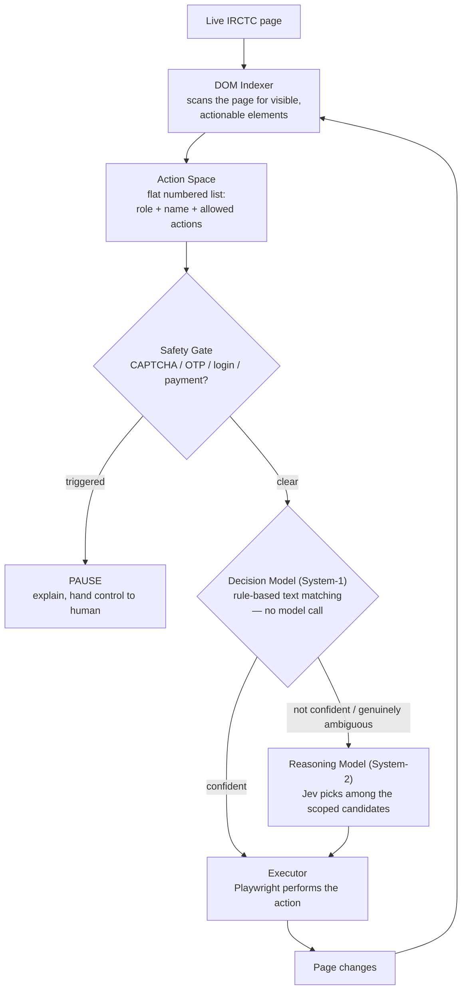

# IRCTC DOM-Native Browser Agent (Prototype)

A research prototype exploring a **DOM-native agent architecture** — a browser
assistant that reads a webpage's live DOM (not a screenshot) to decide what to
click or type, tested end-to-end against the real IRCTC train-search site.

It's built around a **System-1 / System-2 split**, inspired by
[TypeSafe's Jev](https://typesafe.ai): a cheap, deterministic rule engine
handles almost every step, and a real AI model ([Jev](https://typesafe.ai))
only gets called for the handful of moments that genuinely require judgment
(e.g. "the user said *Chennai* — of the 17 stations with that word in the
name, which one do they actually mean?").


*Real, unedited capture of the agent driving irctc.co.in — dismissing the
language popup, typing a station name, and opening/navigating the date
calendar. No steps are staged.*

## What this is *not*

This is a browser-**assistance** experiment, not a booking bot. It is built
to stop, not push through, whenever it reaches a security-relevant boundary:

- It never solves or bypasses a CAPTCHA.
- It never automates OTP entry or logs in on your behalf.
- It never fills in payment details or completes a purchase.
- It stops **before** any "Book"/"Pay"/"Confirm" action — always, with no
  override.
- Anything that looks like a login wall, CAPTCHA, OTP field, or payment step
  triggers an immediate pause with an explanation, and hands control back to
  a human.

The workflow it demonstrates deliberately ends at *"here are 3 real,
bookable trains matching what you asked for"* — one step before booking ever
starts.

## Why DOM-native, not screenshot-based

A lot of "computer use" agents work by taking a screenshot, asking a
vision model where to click, and sending raw (x, y) coordinates to the
mouse. That's brittle — during development, a pixel-coordinate click
literally missed its target after the page reflowed by a few pixels.

This project instead treats **the DOM as the action space**: every step, a
small script walks the live page and extracts a flat, numbered list of
*currently visible, currently actionable* elements (buttons, inputs, links —
whatever a person could actually interact with right now). The decision
layer picks a numbered element and a semantic action (`CLICK`, `TYPE_TEXT`,
...); the browser executor resolves that back to a real DOM element and
performs it. Numbers are never reused across page states — every rebuild is
from scratch, so there's no such thing as a "stale" click target.

## How it works



Almost every tick of that loop is System-1: plain string matching against
element labels ("does this button say *Search Trains*?"). Jev is called
only when the rules genuinely can't decide — in practice, that's picking a
specific station out of a dozen name matches. In a full run, Jev typically
gets called **2 times**; everything else (roughly a dozen other actions) is
free, instant, rule-based matching.

### After the search: filtering, ranking, and checking real availability

The results page lists which classes a train *offers*, but not whether a
seat is actually bookable — that's hidden behind a per-class "Refresh"
link that fetches live seat status. So the last stretch of the pipeline is:

1. **Extract** every train row as plain data (name, times, duration, classes
   offered) — just reading the page, no clicks.
2. **Filter** to trains that list the requested class.
3. **Rank** by: (1) how close the departure time is to what you asked for,
   (2) journey duration as the tiebreaker. No time preference given? It's a
   plain duration sort.
4. **Check real availability**, one train at a time in that ranked order —
   this is the one part of the pipeline that clicks something live on every
   iteration. It stops as soon as 3 confirmed-available trains are found (capped
   at 6 checks), so a good match usually only costs 3-5 live checks.

Fare/price isn't extracted — IRCTC doesn't reveal it anywhere short of
actually entering the booking flow, which is exactly the line this project
doesn't cross.

## Project layout

```
irctc_dom_agent/
├── browser.py          launches a plain, headed Chromium session
├── dom_indexer.py       walks the live DOM → builds the action space (JS injected via Playwright)
├── action_space.py      ActionSpace/ActionSpaceElement schema, per-role allowed actions
├── state.py              STATE + Decision schema, workflow steps, goal-string parsing
├── decision_model.py     System-1: rule-based action selection, no model calls
├── reasoning_model.py    System-2: Jev integration (typesafe-sdk)
├── results.py             results-page extraction, class filter, time+duration ranking, live availability checks
├── executor.py            maps a Decision back onto a real Playwright element
├── safety.py               CAPTCHA/OTP/login/payment detection + irreversible-action gate
└── agent_loop.py           the main loop wiring all of the above together

scripts/
├── print_action_space.py   Phase A demo: DOM → action space JSON, no decisions
├── step_through.py          Phase B demo: heuristic decisions + execution, no Jev
├── run_agent.py              Phase C: the full pipeline, end to end
└── record_demo.py            records the README demo GIF
```

## Setup

```bash
python3 -m venv .venv
source .venv/bin/activate
pip install -r requirements.txt
playwright install chromium
```

Create a `.env` file in the project root (already gitignored) with your
[TypeSafe](https://console.typesafe.ai/) API key:

```
TYPESAFE_API_KEY=sk-...
```

(`JEV_API_KEY` also works as an alias, if that's the name you reach for.)

## Running it

```bash
# Phase A — just look at the extracted action space, no decisions made
python scripts/print_action_space.py

# Phase B — heuristic decisions + execution, no Jev/API key needed
python scripts/step_through.py

# Phase C — the full agent, including Jev-backed disambiguation
python scripts/run_agent.py "Find a 3A train from Chennai to Bangalore on 15/10/2026, preferably departing in the evening"
```

The goal string is parsed with plain regex — no model call — for
`from`/`to`/date/class/preferred-time. Supported time phrasing: an explicit
time ("at 6pm", "around 14:30") or a rough period word ("morning",
"evening", "late night", ...).

### Example output

```
[OPEN] system1: CLICK -> 1 (dismissing blocking dialog via 'English')
[FILL_FROM] system1: TYPE_TEXT -> 5 (matched field 'Enter From station...' for value 'Chennai')
[CONFIRM_FROM_SUGGESTION] system2: CLICK -> 9 (Jev selected 'MGR CHENNAI CTL - MAS ...' confidence 0.99)
[FILL_TO] system1: TYPE_TEXT -> 6 (matched field 'Enter To station...' for value 'Bangalore')
[CONFIRM_TO_SUGGESTION] system2: CLICK -> 8 (Jev selected 'KSR BENGALURU - SBC ...' confidence 0.98)
[FILL_DATE] system1: CLICK -> 7 (opening the date calendar via 'DD/MM/YYYY *')
[SELECT_DATE] system1: CLICK -> 9 (navigating calendar via 'Next Month' toward 10/2026)
[SELECT_DATE] system1: CLICK -> 85 (selecting day '15' in the open calendar (10/2026))
[SEARCH] system1: CLICK -> 13 (matched 'Search Trains')
[IDENTIFY_TRAIN] checked KAVERI EXPRESS (16021): UNKNOWN ('Thu, 15 OctWL5')
[IDENTIFY_TRAIN] checked HUMSAFAR EXP (12504): UNKNOWN ('Thu, 15 OctREGRET')
[IDENTIFY_TRAIN] checked MAS SBC SF MAIL (12657): AVAILABLE ('Thu, 15 OctAVAILABLE-0064')
[IDENTIFY_TRAIN] checked MAS MYS SF EXP (22682): UNKNOWN ('Thu, 15 OctWL1')
[IDENTIFY_TRAIN] checked BAGMATI EXP (12577): AVAILABLE ('Thu, 15 OctAVAILABLE-0056')
[IDENTIFY_TRAIN] checked SANGHA MITRA EX (12296): AVAILABLE ('Thu, 15 OctAVAILABLE-0032')
[DONE] 3 confirmed-available train(s) found for 3A (checked 6 of 8 candidates, priority: closest departure time, then duration):
  MAS SBC SF MAIL (12657) - 22:50 -> 04:35, duration 05:45, Thu, 15 OctAVAILABLE-0064
  BAGMATI EXP (12577) - 10:20 -> 16:55, duration 06:35, Thu, 15 OctAVAILABLE-0056
  SANGHA MITRA EX (12296) - 09:45 -> 16:10, duration 06:25, Thu, 15 OctAVAILABLE-0032
```

## Known limitations

- **Goal parsing is deliberately simple regex, not NLP.** It expects a
  fairly literal "from X to Y on DATE" shape; a loosely-phrased request
  ("need to get to Chennai to see my parents, leaving from Bangalore") won't
  parse correctly. Handing that interpretation step to Jev too would be a
  natural next step — it's out of scope for this prototype on purpose.
- **No price.** Fares aren't exposed anywhere short of the booking flow
  itself, which this project won't enter.
- **Coupled to IRCTC's current markup.** The results-page extraction
  (`results.py`) relies on real CSS class names and structure observed live
  (`.train-heading`, `.pre-avl`, PrimeNG's `.ui-datepicker`, ...). If IRCTC
  changes its frontend, that extraction will need updating — this is
  inherent to DOM-native automation, not a bug to "fix" once.
- **Live seat-availability checks are genuine, rate-limited-by-design live
  requests** — one per candidate train, capped at 6 per run.
